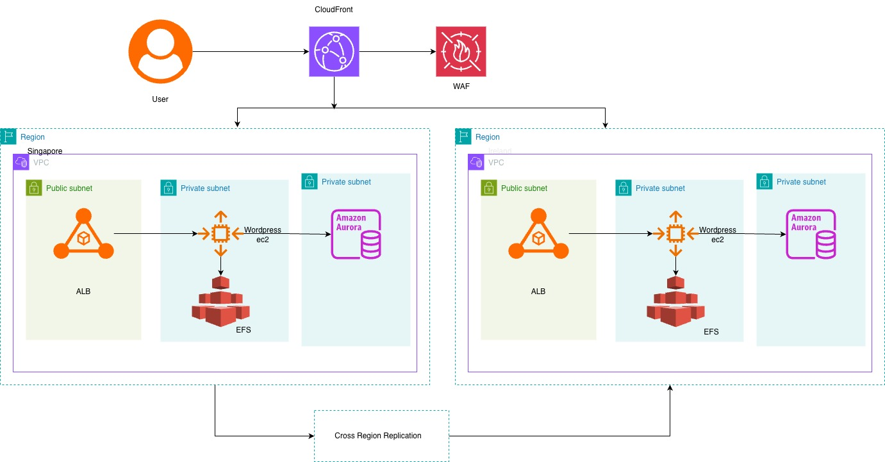

# WordPress on AWS — Global, Immutable Deployment

A global WordPress setup across **Singapore (primary)** and **Ireland (secondary)**,
optimised for uptime, latency, and low complexity. WordPress runs as an immutable
AMI behind an autoscaling group, fronted by CloudFront + WAF, backed by Aurora Global,
with shared uploads on EFS. The DB password is generated into Secrets Manager and
fetched by instances at boot — never typed or committed.

## Architecture




## Layout

```
terraform/
  core-infra/    VPC, subnets, NAT (per region)
  application/   ALB + ASG + Aurora + EFS (per region)
  global/        CloudFront + WAF (once)
  modules/       vpc, alb, asg, aurora, efs
ansible/         WordPress image config
packer/          bakes the AMI (runs Ansible)
python/          post-deploy smoke test
jenkins/         CI/CD pipeline
```

## Prerequisites

Install the tools (macOS):
```bash
brew install terraform packer ansible awscli jq
```

Set AWS credentials:
```bash
export AWS_ACCESS_KEY_ID="..."
export AWS_SECRET_ACCESS_KEY="..."
```

> Notes: Terraform state is local (demo). No DB password to set — it's generated
> into Secrets Manager. **Apply Singapore before Ireland** (Aurora Global rule).

## Deploy

**1. Networking — both regions**
```bash
cd terraform/core-infra
terraform init
terraform apply -var-file=env/singapore.tfvars -state=terraform.singapore.tfstate
terraform apply -var-file=env/ireland.tfvars   -state=terraform.ireland.tfstate
```

**2. Bake the AMI (once, copied to both regions)**
```bash
cd ../../packer
packer init .
packer build -var region=ap-southeast-1 .
SG_AMI=$(jq -r '.builds[-1].artifact_id' manifest.json | tr ',' '\n' | grep '^ap-southeast-1:' | cut -d: -f2)
IE_AMI=$(jq -r '.builds[-1].artifact_id' manifest.json | tr ',' '\n' | grep '^eu-west-1:'      | cut -d: -f2)
```

**3. Application — Singapore, then Ireland**
```bash
cd ../terraform/application
terraform init
terraform apply -var-file=env/singapore.tfvars -state=terraform.singapore.tfstate -var ami_id=$SG_AMI
terraform apply -var-file=env/ireland.tfvars   -state=terraform.ireland.tfstate   -var ami_id=$IE_AMI
```

**4. Global edge (CloudFront + WAF)**
```bash
IE_ALB=$(terraform output -state=terraform.ireland.tfstate -raw alb_dns_name)
cd ../global
terraform init
terraform apply -var "secondary_origin_domain=$IE_ALB" -var 'blocked_country_codes=["CN"]'
```

**5. Get the URL + smoke test**
```bash
CF=$(terraform output -raw cloudfront_domain_name)
python3 ../../python/smoke_test.py "https://$CF"
# open https://$CF in a browser
```

## Teardown (reverse order)

```bash
# Global edge
cd terraform/global && terraform destroy

# Application — Ireland first, then Singapore
cd ../application
terraform destroy -var-file=env/ireland.tfvars   -state=terraform.ireland.tfstate   -var ami_id=$IE_AMI
terraform destroy -var-file=env/singapore.tfvars -state=terraform.singapore.tfstate -var ami_id=$SG_AMI

# Networking
cd ../core-infra
terraform destroy -var-file=env/ireland.tfvars   -state=terraform.ireland.tfstate
terraform destroy -var-file=env/singapore.tfvars -state=terraform.singapore.tfstate
```

`ami_id` is required on destroy but its value is ignored — any `ami-xxxx` works if the
`$SG_AMI`/`$IE_AMI` vars aren't set in your shell. Finally, clean up the Packer AMIs
(not tracked by Terraform) in **both** regions: deregister the AMI and delete its
snapshot from the EC2 console or via `aws ec2`.

## CI/CD (optional)

`jenkins/Jenkinsfile` runs the same flow: bake AMI → per-region plan → manual
approval → apply. Needs `terraform/packer/ansible/awscli` on the agent and AWS
credentials as Jenkins secrets.
